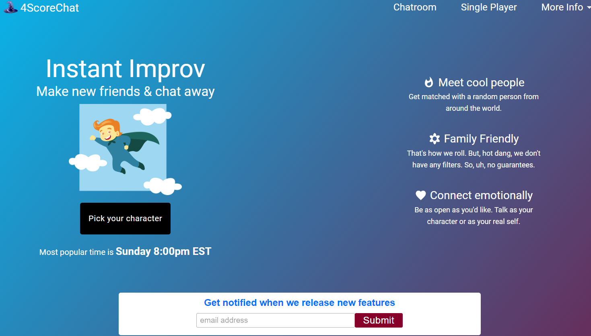
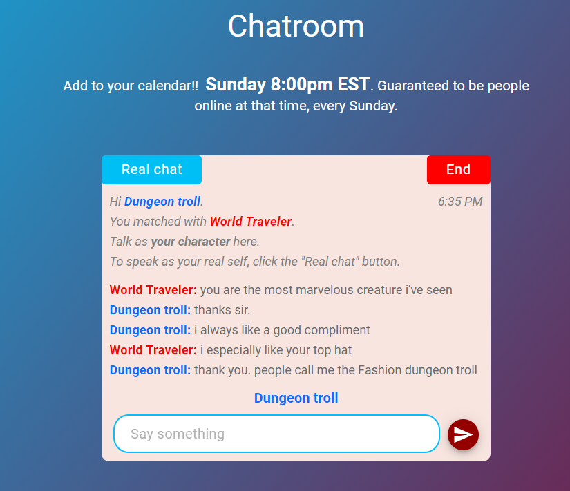
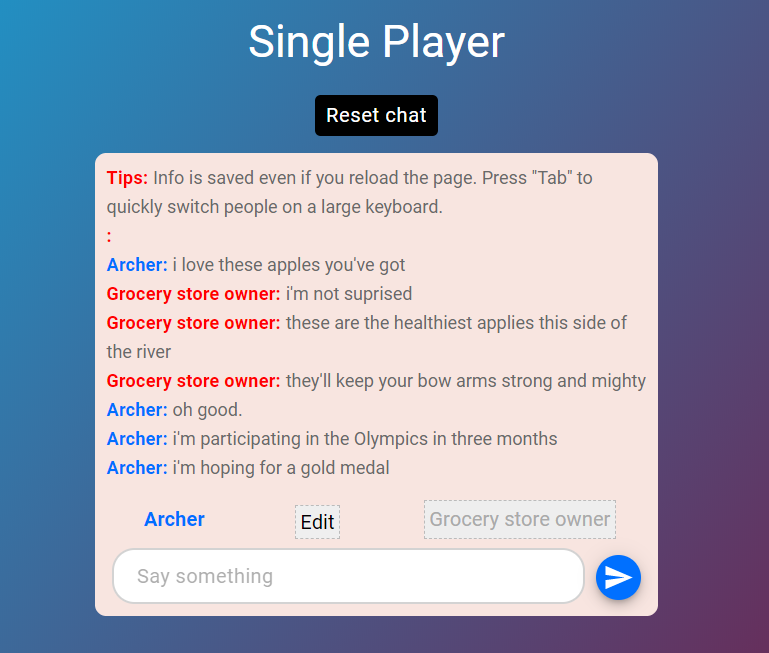

# 4ScoreChat - Front End Client Code

4ScoreChat lets you pick a character and instantly start chatting with a stranger. It's perfect for fans of improv. You can also choose 'single-player' mode to create your own sketches.

## Live site

### [4scorechat.com](https://www.4scorechat.com/)

- Front end hosted on Netlify
- Backend hosted on Heroku
- Domain name purchased through Google Domains

## Tech stack

- React
- Gatsby
- CSS Grid
- Node / Express
- SocketIO
- Mailchimp

## Homepage

## Sample chat

## Single player

## Setup instructions

1. `npm install`
2. `npm run develop`
3. Download the [backend repo](https://github.com/mssiegel/4Score-server) and run it on a separate server

## Backend Repo

https://github.com/mssiegel/4Score-server

## Features

- Random pairing for live chats
- Suggested characters
- Switching between your character and your real self
- Single player mode
- Email marketing signup

## Engineering best practices

Our 4ScoreChat best practices are located within our: [4ScoreChat Goals Sheet](https://docs.google.com/spreadsheets/d/1PkG1mRXymWYBgnN4pESpvPua2qOoHGQWorhFzF63ATo) (permission is needed to access sheet)
